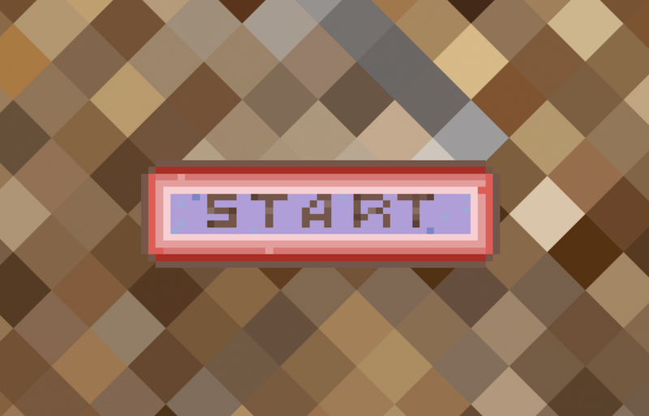
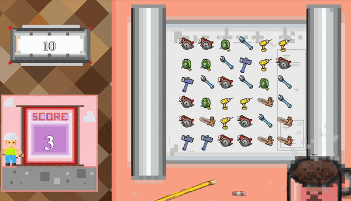
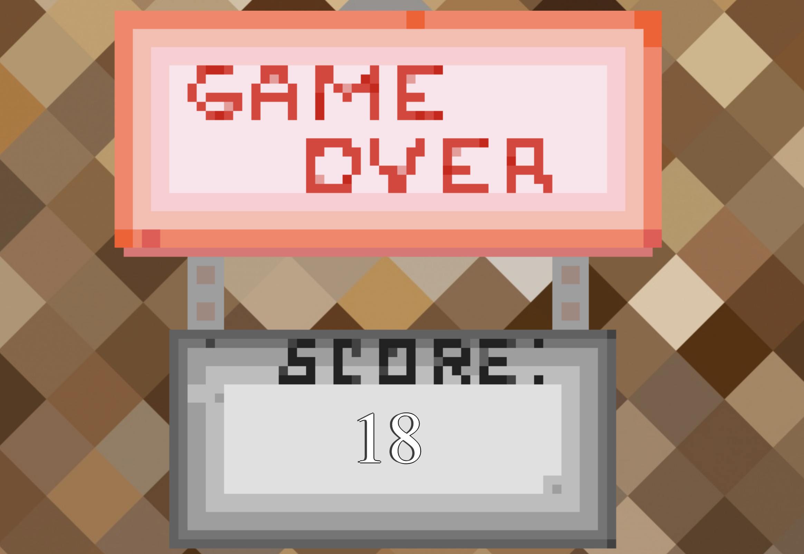

# Welcome to Tool_Crush!

### A front-end mini game built with react. Player needs to drag and drop tools in order to complete 3 or 4 element columns/rows in 30 seconds. Successful matches will reward a player with points: 1 point for each of the matched tools. Game is made in a pixel-art style with all the animations drawn by the author. Enjoy!

## Initial setup

After cloning the repo, inside a game folder, run ```npm install``` and then ```npm start``` to run the game.




